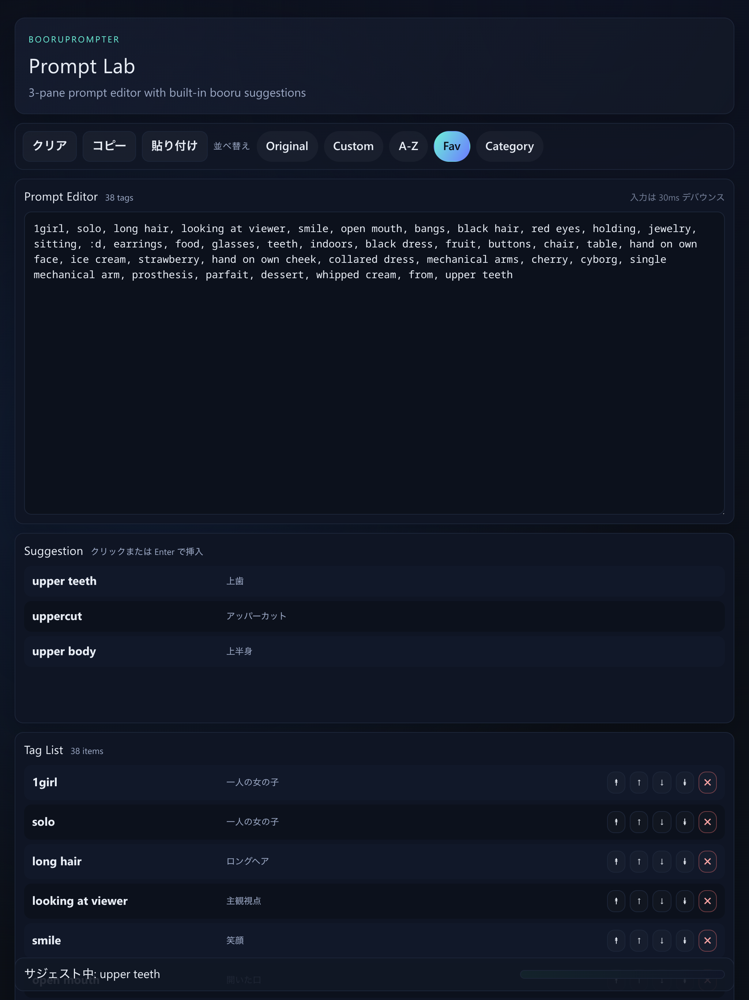

# BooruPrompter

Webアプリケーション版のBooruPrompterは `rs` ディレクトリ以下にあります。

サジェスト機能に特化した画像生成用のプロンプト入力支援ツールです。

WebツールじゃなくてWindowsアプリです！  
（高速なサジェスト機能が欲しかったので……）

## 主な機能

### 高速タグサジェスト
- 入力しているタグのサジェストを下のペインにリアルタイム表示
- スペルが近いタグもおすすめ（あいまい検索対応）
- プロンプト欄に日本語を入れると逆引きでタグをおすすめ

### タグ管理
- 現在のタグ一覧を右のペインに表示
- ドラッグ&ドロップでタグの順序を簡単に入れ替え
- 右クリックメニューで並べ替えや削除が可能

### 画像解析・メタデータ抽出
- 画像を解析してプロンプトを生成（タグ抽出）
- AI生成の画像からは生成時のプロンプトを抽出（NovelAIやMidjurneyの画像にも対応）

### 便利な操作メモ
- エクスプローラ等から画像ファイルをドラッグ＆ドロップすると解析
- サジェスト欄でタグをダブルクリックすると自動入力
- 「貼り付け」「コピー」で入力欄全体の内容を簡単コピペ

### 独自ルールのタグ整理 [NEW]
なんか良い感じにまとめます。

## 必要条件
- Windows 10以降
- オフラインで動作（通信不要）  
  ※ ただしプロンプト生成機能の初回使用時のみAIモデルをダウンロードします

## ライセンス

`MIT License`です。  
自由に使ってください！

## 利用ライブラリ等
- [rapidfuzz-cpp](https://github.com/rapidfuzz/rapidfuzz-cpp) - 高速なあいまい検索ライブラリ
- [booru-japanese-tag](https://github.com/boorutan/booru-japanese-tag) - Danbooruのタグの日本語化プロジェクト
- [ONNX Runtime](https://onnxruntime.ai/) - 生成AIランタイム
- [Scintilla](https://www.scintilla.org/) - コードエディタ向けのコンポーネント

